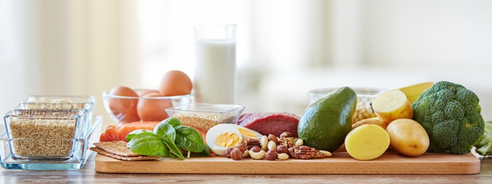

# Kaggle Cuisine Prediction in Scala

This is my ongoing work for Kaggle's [What's Cooking?- Kernels Only](https://www.kaggle.com/c/whats-cooking-kernels-only) competition,
where the task was to **predict a dish's cuisine (e.g. Greek, Korean, etc.), given its list of ingredients**.

It is written in Scala and Spark MLlib, in Databricks environment.

Progress Logs
1. Nov 22, 2020 : 
* Baseline model : Multinomial Logistic Regression with regParam=0.01, maxIter=50
* tf-idf embedding (valid accuracy: 75.8%) 
* word2vec embedding (valid accuracy: 50.0%)

Happy Cooking!
